Brightness maps
=====================================

Spherical Harmonics
-----------------------

A spherical harmonics model, the user can specify the co-eficients for as many terms as desired. Spherical harmonics models are useful, since they do not make any physical assumptions about the distribution you wish to recover. It can be useful to check the results of a physically motivated model against the results of a spherical harmonic fit. Called with "spherical".

main parameters:

    **degree**
        The maximum degree of Harmonic you want to consider (You won't typically want more than 2)

    **la0**
        Offset of the center of the co-ordinte centre from the substellar point in the latitude direction (unit: Degrees)

    **lo0**
        Offset of the center of the co-ordinte centre from the substellar point in the longitude direction (unit: Degrees)

    **sph**
        A list of the co-efficients for the harmonic terms, there *must* be the appropriate number (degree squared), and arranged in the correct order: [l0, l1 m-1, l1 m0, l1 m1, l2 m-2, l2 m-1, l2 m0, l2 m1, l2 m2..... etc]. These parameters are scaled to be relative to the stellar flux, so will typically be of order 1e-3 - 1e-4.

.. warning:: There is nothing implicit in this spherical harmonics implementation to prevent negative surface fluxes! It is suggested that care is taken when specifying priors to prevent unphysical results.

An example square plot using a two degree spherical harmonic using the l0 m0 and l1 m1 terms only - this is a simple dipole, and can represent a day/night side difference:

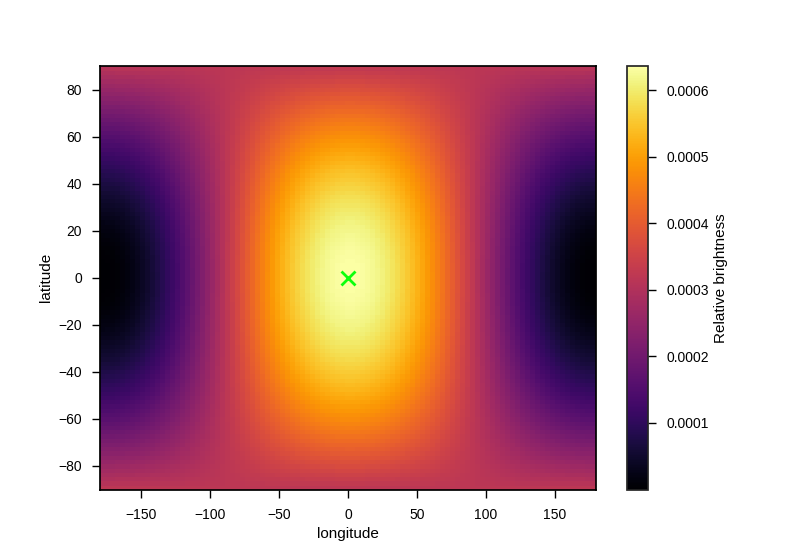

This time the hotspot is offset by adding the l1 m-1 term. (the same effect can also be achieved by changing the la0 and lo0 parameters, but never try to fit for both simultaneously, as it's degenerate!):

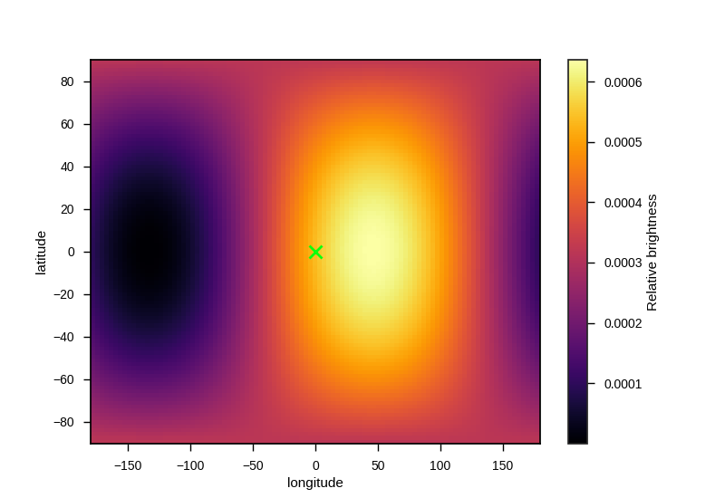

Now, with a higher order term added, l2 m0, to concentrate flux towards the equator.

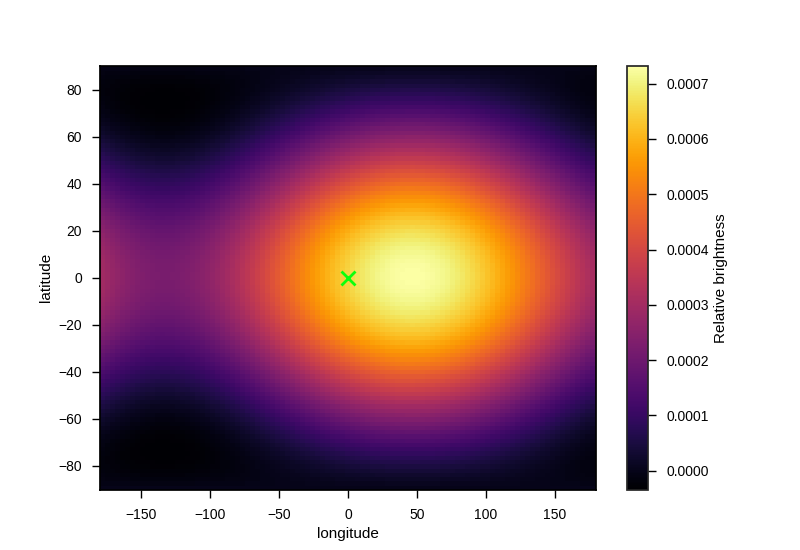

An example four phase plot with this distribution:

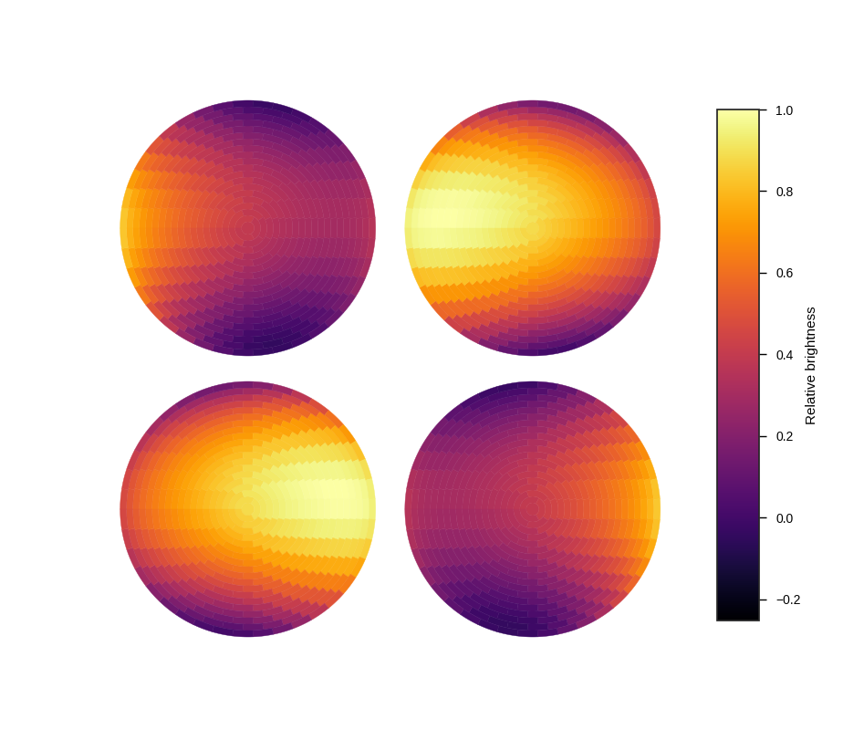

The resulting lightcurves for the three example distributions:

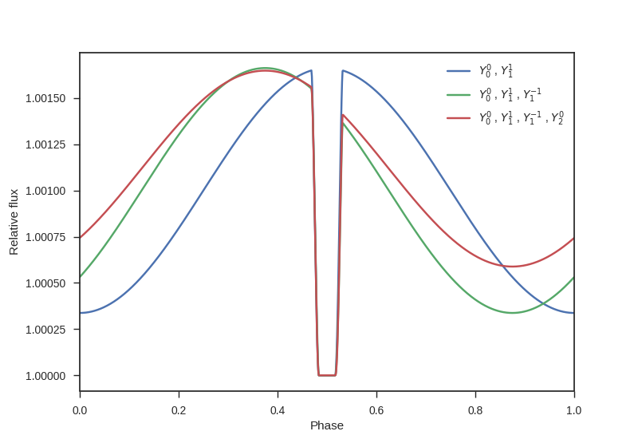

Zhang and Showman 2017
-----------------------

A temperature map based on the equations given in the appendix of Zhang and Showman 2017 (http://adsabs.harvard.edu/abs/2017ApJ...836...73Z) This semi-physical model well reproduces the main features of hot Jupiter phase-curves - offset hotspots. Called with "zhang"

main parameters:

	**xi**
		Ratio of radiative to advective timescale (unit: Unitless)

	**T_n**
		Temperature of the nightside of the planet (unit: Kelvin)

	**delta_T**
		Day-night temperature contrast (unit: Kelvin)

An example square plot:

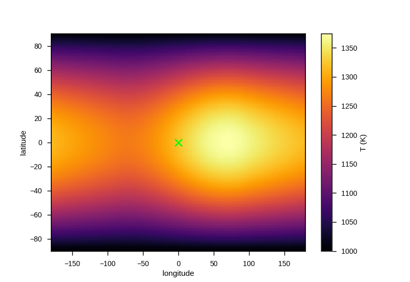

An example four phase plot:

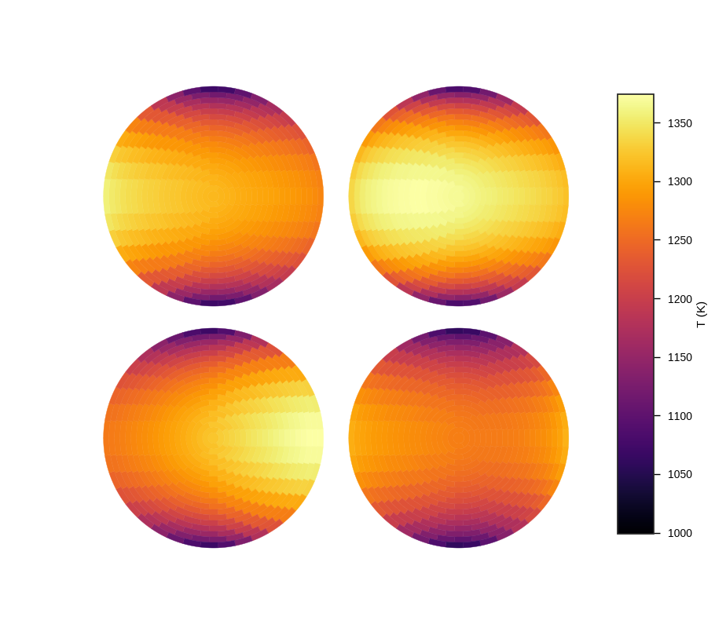

The resulting lightcurves for several parameter values

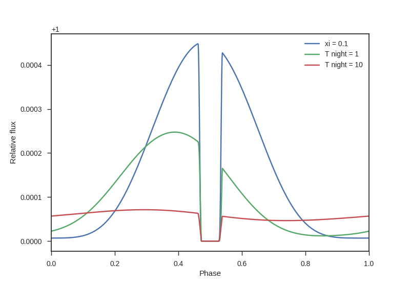

Offset hotspot
--------------------

main parameters:

	**la0**
		Offset of the center of the hotspot in the latitude direction (unit: Degrees)

	**lo0**
		Offset of the center of the hotspot in the longitude direction (unit: Degrees)

	**size**
		The radius of the hotspot in degrees, i.e., 90 means the hotspot covers a whole hemisphere. (unit: degrees)

The hotspot can either be specified as "hotspot_b", to directly specify the fractional brightness, in which case these parameters are used:

	**spot_b**
		The surface brightness of the hotspot as a fraction of the surface brightness of the star, typically of order ~1e-4 for hot Jupiters (unitless)

	**p_b**
		The surface brightness of the planet that is not in the hotspot as a fraction of the surface brightness of the star. This value will depend strongly on the physics of heat transport in the planets atmosphere and may be several orders of magnitude fainter than the spot (unitless)

Or as "hotspot_t" to specify in terms of brightness temperature, in which case the following parameters are used instead. In this case the wavelength range to integrate over must be specified.

	**spot_T**
		The surface brightness of the hotspot as a fraction of the surface brightness of the star, typically of order ~1e-4 for hot Jupiters (unitless)

	**p_T**
		The brightness temperature of the planet that is not in the hotspot as a fraction of the surface brightness of the star. This value will depend strongly on the physics of heat transport in the planets atmosphere and may be several orders of magnitude fainter than the spot (unitless)

.. note::  Because there is a sharp contrast in flux levels between *spot* and *not spot* regions, this brightness model can have issues with quantisation, which produces unphysical "steps" in the lightcurve. This can be for the time being be solved by including a numerical integration step in regions with sharp contrasts with the optional paramter "grid_size"

cont

	**grid_size**
		This model has a sharp boundary, so can have quantization issues. Regions with sharp changes in brightness are for now integrated numerically instead of analytically, this sets the number of grid points to use in the integration along each direction, to the total number of additional function calls will be this value squared. Setting this too high can significantly slow the code down, however if it is too low fits may be numerically unstable. Use caution. This is a temporary fix and is intended to be removed in a future version (default: 10)

An example square plot:

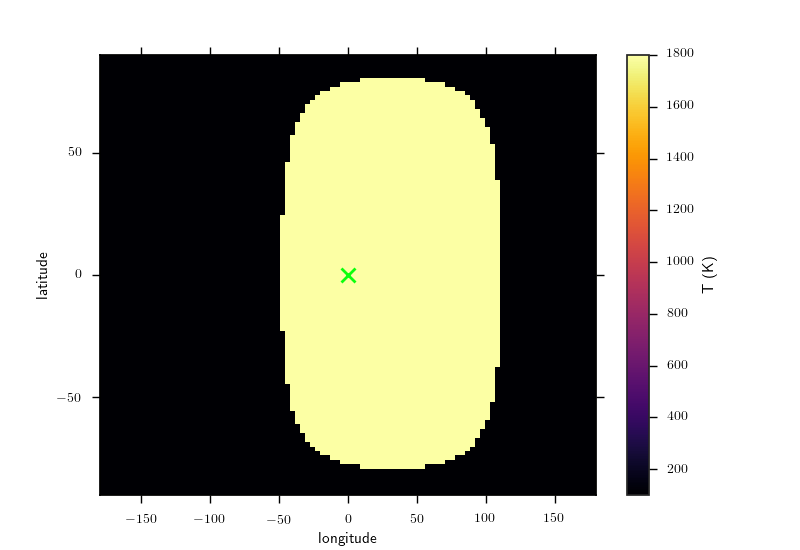

An example four phase plot:

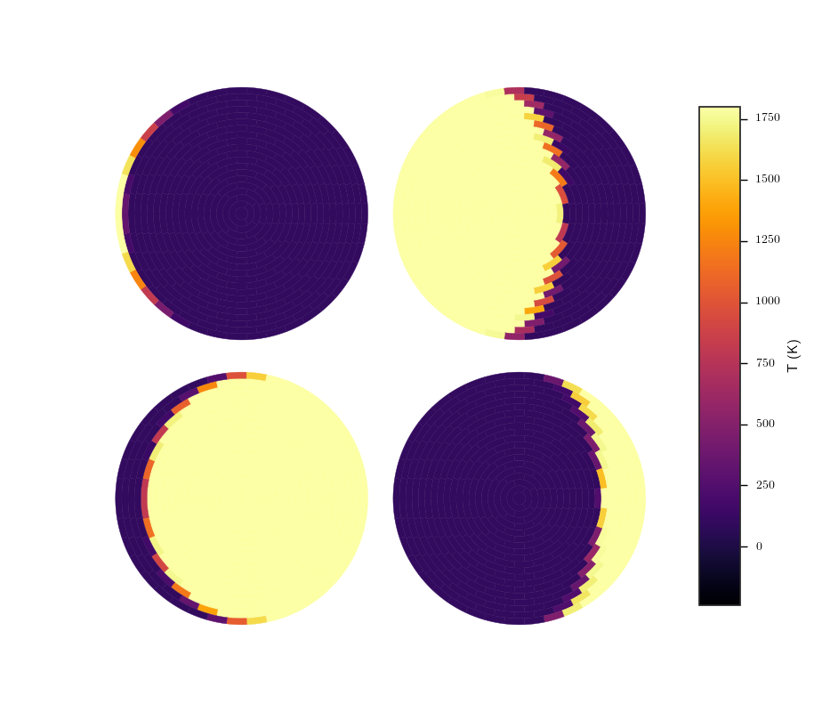

The resulting lightcurves for several parameter values

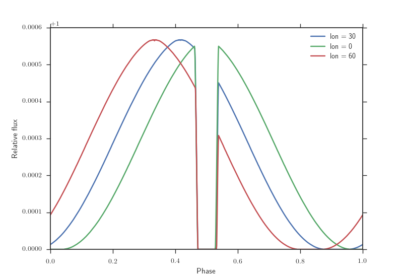

Two sided planet
--------------------

This is a simple model that only assumes that the day-side of the planet has a different flux or temperature to the night side. can be called as "two temperature" to specify with brightness temperature, or "two brightness" to secify by flux

main parameters:

The hotspot can either be specified as "hotspot_b", to directly specify the fractional brightness, in which case these parameters are used:

	**pb_d**
		The surface brightness of the dayside as a fraction of the surface brightness of the star, typically of order ~1e-4 for hot Jupiters (unitless)

	**pb_n**
		The surface brightness of the planet nightside as a fraction of the surface brightness of the star. This value will depend strongly on the physics of heat transport in the planets atmosphere and may be several orders of magnitude fainter than the spot (unitless)

Or as "hotspot_t" to specify in terms of brightness temperature, in which case the following parameters are used instead. In this case the wavelength range to integrate over must be specified.

	**spot_T**
		The surface brightness of the hotspot as a fraction of the surface brightness of the star, typically of order ~1000 K for hot Jupiters (unit: kelvin)

	**p_T**
		The brightness temperature of the planet that is not in the hotspot. This value will depend strongly on the physics of heat transport in the planets atmosphere and may be significantly cooler than the spot (unit: degrees)

.. note::  Because there is a sharp contrast in flux levels between *spot* and *not spot* regions, this brightness model can have issues with quantisation, which produces unphysical "steps" in the lightcurve. This can be for the time being be solved by including a numerical integration step in regions with sharp contrasts with the optional paramter "grid_size"

cont

	**grid_size**
		This model has a sharp boundary, so can have quantization issues. Regions with sharp changes in brightness are for now integrated numerically instead of analytically, this sets the number of grid points to use in the integration along each direction, to the total number of additional function calls will be this value squared. Setting this too high can significantly slow the code down, however if it is too low fits may be numerically unstable. Use caution. This is a temporary fix and is intended to be removed in a future version (default: 10)

An example square plot:

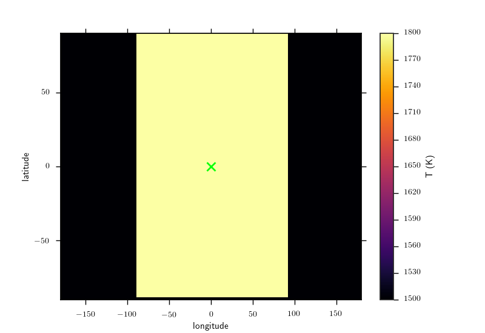

An example four phase plot:

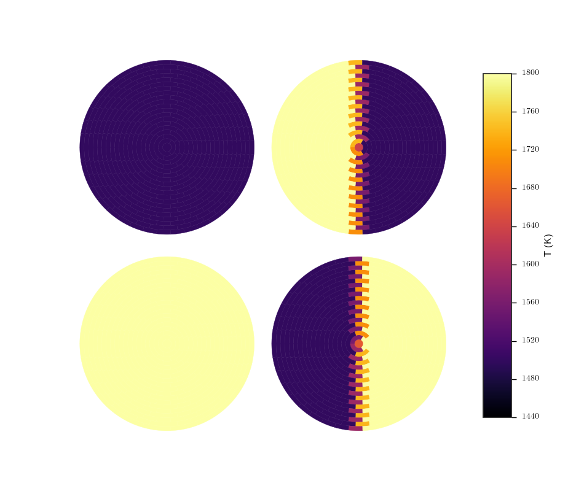

The resulting lightcurves for several parameter values

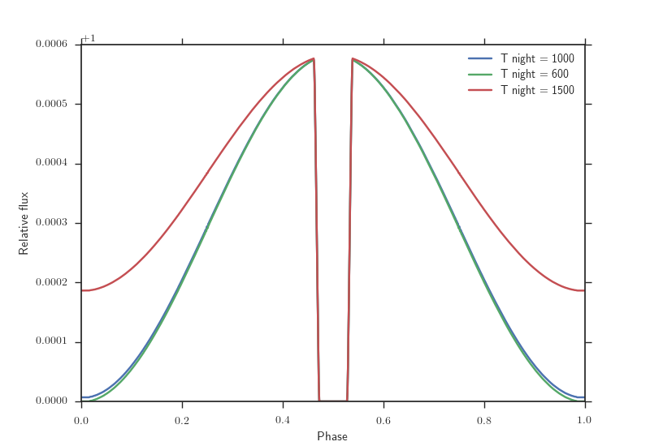

Forward model
--------------------

SPIDERMAN also has the capability to take the results of forward models and project them onto a planet, to quickly generate a phase curve and secondary eclipse from your favourite model output. SPIDERMAN uses bicubic interpolation to produce smooth and neat looking results from coursely sampled grids.

main parameters:

This model is called as either "direct_b", in which case the brightness grid is expected to be specified *relative to the brightness of the star*, or as "direct_T", in which case the grid is expected as brightness temperatures and stellar Temperature and filter details will also be needed. The call parameters are:

    **grid**
        A list containing the longitude and latitude axis (in degrees) and a 2d array of flux/temperature. SPIDERMAN has a tool (format_grid) to generate this grid in the correct format.

How to use "format_grid":

.. code-block:: python
    
    import spiderman as sp
    spider_params = sp.ModelParams(brightness_model="direct_b")

    ### specify orbital parameters ###

    spider_params.grid = sp.format_grid(lo,la,flux)

Where lo, la and flux are the longitude, latitude and flux values, which can either be given as 2d arrays or a flattened list. The dimensions **must** match.

This method allows you to test any arbitrary brightness distribution, so, for example, here is a map of "SPIDERMAN-1b"

An example four phase plot:

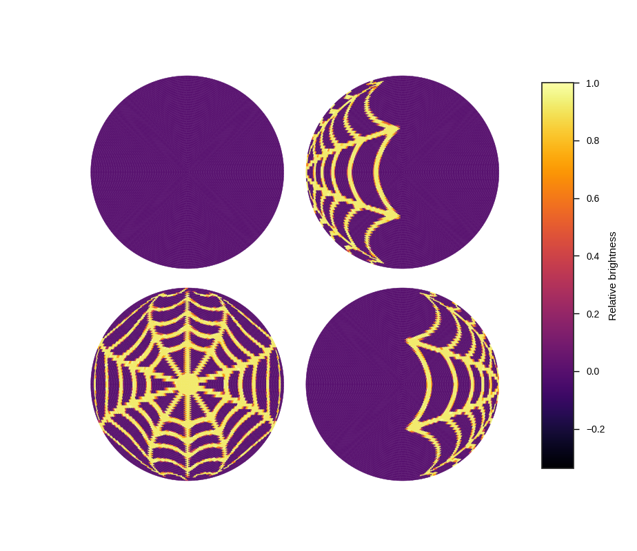

An example square plot:

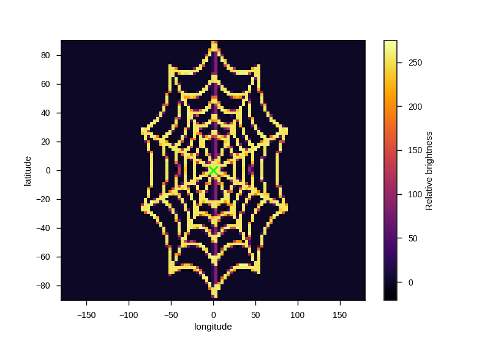

And the resulting phasecurveL

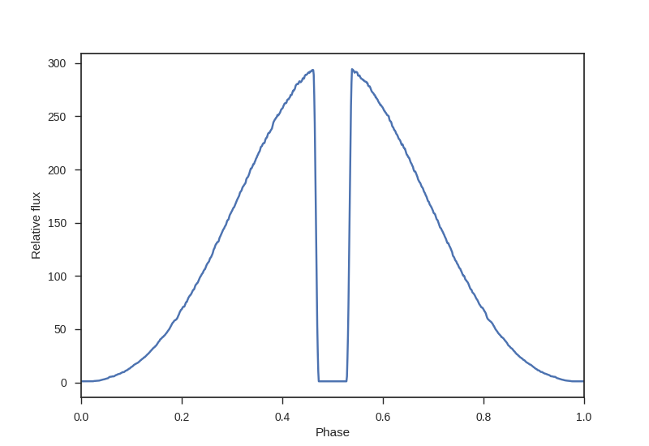