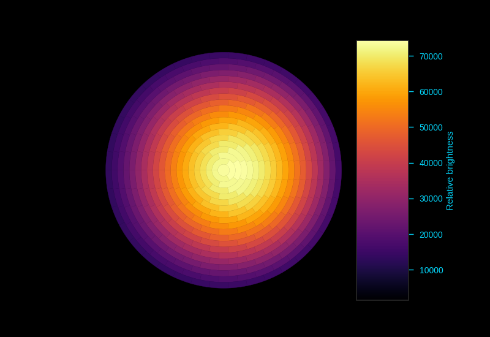
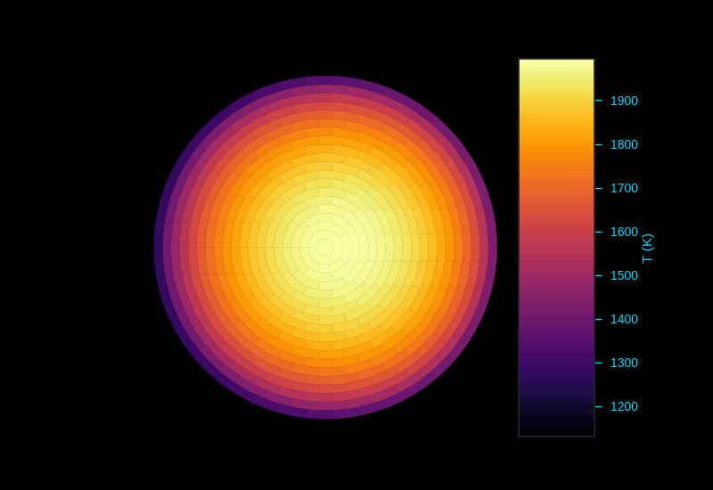
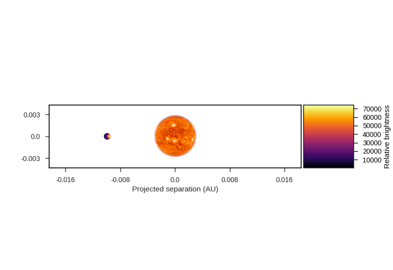
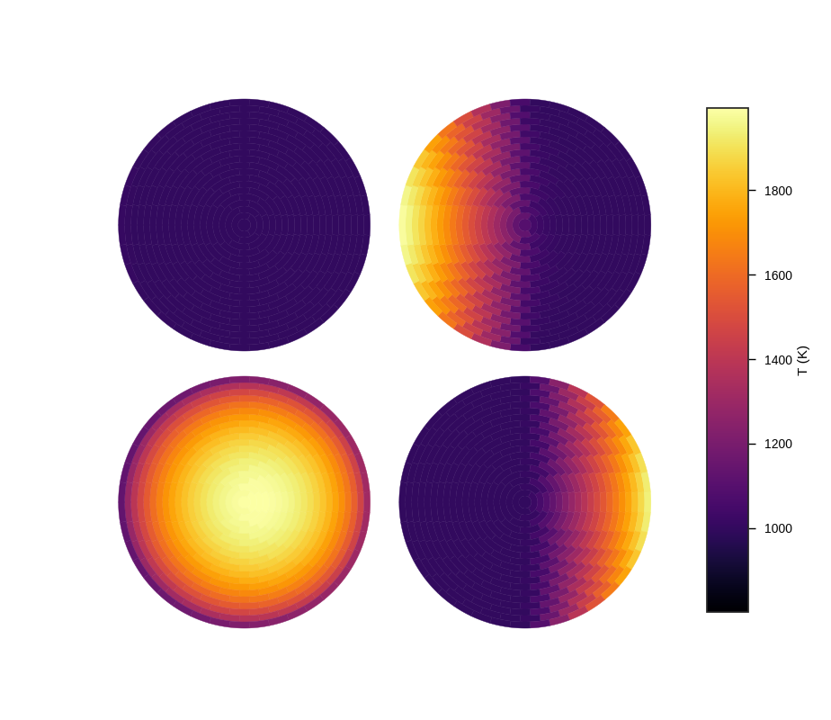
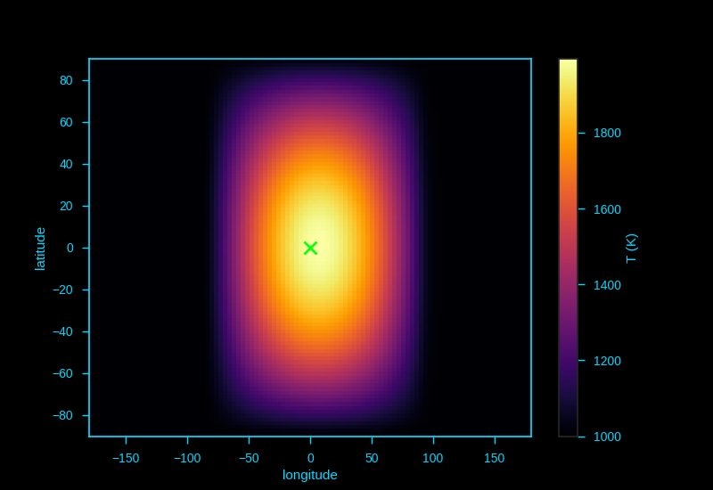
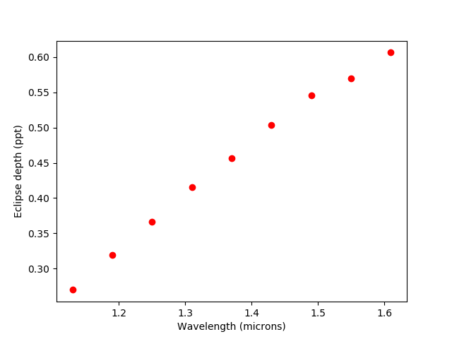
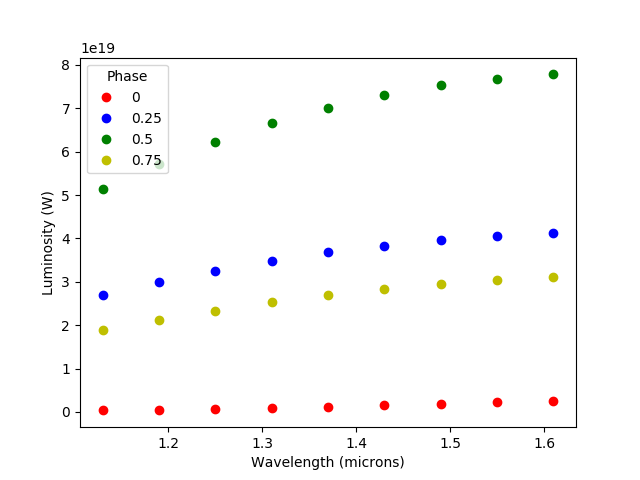

Plotting 
============

Visualising the planet
-----------------------

Spiderman provides a few different ways to visualise the resulting brightness distribution on the planet, below are some examples, after the planet has been specified with "spider_params"

The "plot_planet" method outputs the visible face of the planet at the specified time (t), using the same code that is used internally for calculating the model output. This can be a useful sanity check of what the model is doing.

.. code-block:: python
	spider_params.plot_planet(t)

.. figure:: images/planet_map.png
    :width: 800px
    :align: center
    :alt: alternate text
    :figclass: align-center

By default the plot will be in a standard white theme suitable for inclusion in papers or printouts, alternatively a snazzy black theme more suited to powerpoint presentations can be selected for all spiderman plots by setting the "theme" keyword to black:

.. code-block:: python
	spider_params.plot_planet(t,theme=black)

Note that to save figures like this, you will have to let matplotlib know that you want to to output the figure with a black background, e.g.

.. code-block:: python
	plt.savefig('plot_name.pdf',facecolor='black')

For brightness temperature based models like the Zhang model, you can also plot in temperature by setting "use_temp" to true

.. code-block:: python
	spider_params.plot_planet(t,theme='black',use_temp=True)

To see the system in context, you can also output a "system plot" which shows the projected position of the planet to scale with the star. Again, this plot is constructed from the same code used internally for model calculation, so is a good way to check what's going on. Both plot_planet and plot_system can accept a phase instead of a time when the use_phase keyword is set to True

.. code-block:: python
	spider_params.system_plot(0.625,use_phase=True)

"Quad_plot" gives you a quick way to see the projected appearence of the planet at primary and secondary eclipses, and at phase 0.25 and 0.75. It has the same theming options and is able to plot either flux or temperature.

.. code-block:: python
	spider_params.system_plot(theme='white',use_temp=True)

Sometimes you just want a straightforward global map - in spiderman this is generated by the "square_plot" command. This function does not use the typical spiderman segment scheme, and instead evaluates the brightness function on an evenly spaced grid in longitude and latitude. The number of grid points in the latitude and longitude direction are specified by nla and nlo keywords, respectively.

.. code-block:: python
	nn = 100
	spider_params.square_plot(theme='black',use_temp=True,nla=nn,nlo=nn)

end

Generating a simple spectrum
-----------------------------

Sometimes you don't want to bother with running a full orbital model, and just want a quick estimate of the eclipse depth of system. Spiderman has a couple of techniques to allow you to do this.

If all you want is the eclipsed depth, you can use the "eclipse_depth" method, like so:

.. code-block:: python

	import spiderman as sp
	import numpy as np
	import matplotlib.pyplot as plt

	spider_params = sp.ModelParams(brightness_model='zhang')
	spider_params.n_layers = 5

for this example we'll use a Zhang and Showman type model with 5 layers, next the relevent model parameters are entered - 

.. code-block:: python

	spider_params.l1 = 1.1e-6	# The starting wavelength in meters
	spider_params.l2 = 1.7e-6	# The ending wavelength in meters

	spider_params.T_s = 4520
	spider_params.rp = 0.159692

	spider_params.xi = 0.1
	spider_params.T_n = 1000
	spider_params.delta_T = 1000

Note that if all you want is a simple eclipse depth, there's no need to enter the orbital parameters. Spiderman will assume a circular orbit and an inclination of 90 degrees unless you tell it otherwise. Now, you can call the eclipse_depth:

.. code-block:: python

	d = spider_params.eclipse_depth()
	print(d)
	>> 0.00045781826310942186

This method can be used to quickly generate an occultation spectrum of the depth as a function of wavelength, like so:

.. code-block:: python

	min_wvl = 1.1e-6
	max_wvl = 1.7e-6
	steps = 10
	wvl_step = (max_wvl-min_wvl)/steps

	for i in range(0,steps-1):
		spider_params.l1 = min_wvl + wvl_step*i
		spider_params.l2 = min_wvl + wvl_step*(i+1)

		mid_wvl = min_wvl + wvl_step*(i+0.5)
		d = spider_params.eclipse_depth()
		plt.plot(mid_wvl*1e6,d*1000,'ro')
	
	plt.xlabel('Wavelength (microns)')
	plt.ylabel('Eclipse depth (ppt)')

Some caution must be used with this method, as it only returns the *blocked light* relative to the stellar brightness at the specified phase - so for an example, if you were to specify a grazing transit you would not recieve the total flux of the dayside.

If you do want the total flux of the planet from a specific phase, you can instead use the "phase_brightness" method. Using this method you can calulate the emission spectrum of the planet in *physical units* at the phase of your choosing, it is called in a similar way to eclipse_depth, but has an optional phase argument which can accept either a single phase value or a list. You can provide a planet radius to recieve the total band luminosity of the visible hemisphere in Watts, if this is not given then an average surface intensity will be returned.

.. code-block:: python
	mid_wvls = []
	p1s = []
	p2s = []
	p3s = []
	p4s = []

	for i in range(0,steps-1):
		spider_params.l1 = min_wvl + wvl_step*i
		spider_params.l2 = min_wvl + wvl_step*(i+1)

		mid_wvl = min_wvl + wvl_step*(i+0.5)
		mid_wvls += [mid_wvl*1e6]

		p1, p2, p3, p4 = spider_params.phase_brightness([0.0,0.25,0.5,0.75],planet_radius=6.9911e7)

		p1s += [p1]
		p2s += [p2]
		p3s += [p3]
		p4s += [p4]

	plt.plot(mid_wvls,p1s,'ro',label = '0')
	plt.plot(mid_wvls,p2s,'bo',label = '0.25')
	plt.plot(mid_wvls,p3s,'go',label = '0.5')
	plt.plot(mid_wvls,p4s,'yo',label = '0.75')

	plt.legend(title='Phase')
	plt.xlabel('Wavelength (microns)')
	plt.ylabel('Luminosity (W / sr)')

Finally, you can use the total_luminosity method to return the total band luminosity of the planet in the model in Watts, a planet radius in meters is required:

.. code-block:: python
	spider_params.l1 = 1.1e-6
	spider_params.l2 = 1.7e-6
	lum = spider_params.total_luminosity(10*6.9911e7)
	print(lum)
	>> 7.03802421799e+20

end.
