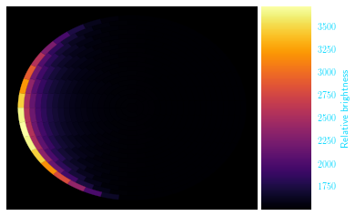

Quickstart
============
Making a lightcurve
---
This is likely the basic task that you need SPIDERMAN to perform, to, for example, form the basis for a likelihood function being fed into an mcmc. Here is how to return a simulated lightcurve from SPIDERMAN, the fast way.

    figure are like images but with a caption

and whatever else youwish to add

.. code-block:: python

    import image

.. warning:: SPIDERMAN currently only produces secondary eclipses and phase-curves - the primary eclipse will not be modelled! To model the primary eclipse an additional code, such as BATMAN (Kreidberg et al 2015) will be required.