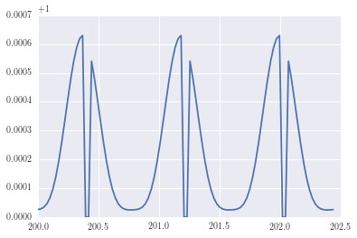

Quickstart
============
Making a lightcurve
---
This is likely the basic task that you need SPIDERMAN to perform, to, for example, form the basis for a likelihood function being fed into an mcmc. Here is how to return a simulated lightcurve from SPIDERMAN, the fast way.

First, import spiderman into the namespace:

.. code-block:: python

    import spiderman as sp

Now, it is necesarry to generate a parameter object, this will be the main way of interacting with the code. Before doing so, you must specify which brightness model (link to brightness model page) you wish to use. In this example we will use the analytical formula from Zhang & Showman 2016, but many other options are availible (If you have a brightness model that is not represented, please contact me, and I will include it in the next release of the package).

.. code-block:: python

	spider_params = sp.ModelParams(brightness_model='xi')

Now that the parameter object has been created, we can define the parameters as so:

.. code-block:: python

	spider_params.n_layers= 5

This parameter refers to the number of layers in the 2d "web" used to define the integration grid. 5 is typically acceptable for most availible data qualities. Next we will define the system parameters, using values suitable for WASP-43b

.. code-block:: python

	spider_params.t0= 200               # Central time of PRIMARY transit [days]
	spider_params.per= 0.81347753       # Period [days]
	spider_params.a_abs= 0.01526        # The absolute value of the semi-major axis [AU]
	spider_params.inc= 82.33            # Inclination [degrees]
	spider_params.ecc= 0.0              # Eccentricity
	spider_params.w= 90                 # Argument of periastron
	spider_params.rp= 0.1594            # Planet to star radius ratio
	spider_params.a= 4.855              # Semi-major axis scaled by stellar radius
	spider_params.p_u1= 0               # Planetary limb darkening parameter
	spider_params.p_u2= 0               # Planetary limb darkening parameter

.. note::  these definitions are compatible with Batman (Kreidberg et al 2015)

Now set the parameters specific to the brightness model that we defined earlier:

.. code-block:: python

	spider_params.xi= 0.3       # Ratio of radiative to advective timescale             
	spider_params.T_n= 1128     # Temperature of nightside
	spider_params.delta_T= 942  # Day-night temperature contrast
	spider_params.T_s = 4500    # Temperature of the star

Now, define the times you wish the model to be evaluated at, let's do a single full orbit:

.. code-block:: python
	t= spider_params.t0 + np.linspace(0, + spider_params.per,100)

Finally, a lightcurve can be generated simply by using the "lightcurve" method:

.. code-block:: python
	lc = spider_params.lightcurve(t)
	plt.plot(t,lc)

    The resulting lightcurve

.. warning:: SPIDERMAN currently only produces secondary eclipses and phase-curves - the primary eclipse will not be modelled! To model the primary eclipse an additional code, such as BATMAN (Kreidberg et al 2015) will be required.

It's that simple!